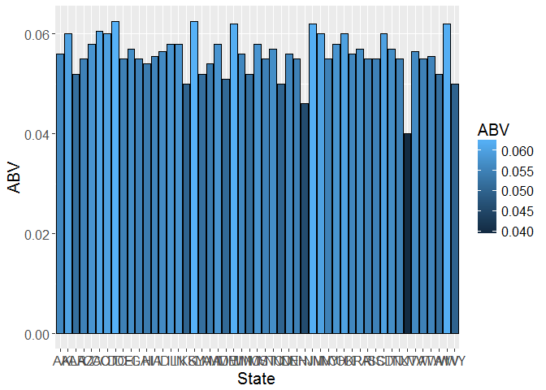
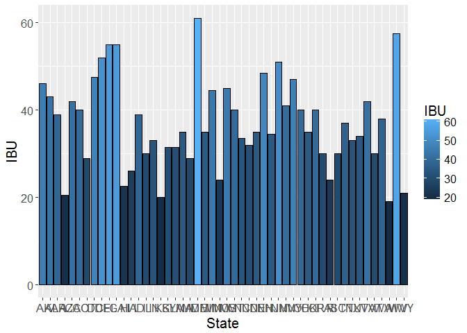
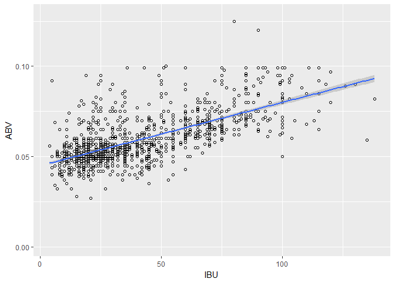

# Case Study 1
Murtada Shubbar  
June 30, 2017  


knitr::opts_chunk$set(echo = TRUE) 

Data Analysis: Murtada Shubbar
 
The data analyzed in this case study summarizes and visualizes two data sets, 
craft beers and breweries from the United States. Included in the data is a list of 
2410 beer variations and 557 breweries from all 51 States. The data also includes the 
following: City, Names, IDs, Alcohol by Volume (ABV), International Bitterness Unit (IBU),etc. z

After merging the data, we will be computing the median alcohol content and IBU for
each state, identifying which state has the maximum alcoholic beer and bitterness, 
summarize ABV, and find relationships between bitterness and alcoholic content.
Some visual aids such (plots) will be accompanying the data for further clarification. 


#################################################################

```r
R.version 
```

```
##                _                           
## platform       x86_64-w64-mingw32          
## arch           x86_64                      
## os             mingw32                     
## system         x86_64, mingw32             
## status                                     
## major          3                           
## minor          4.0                         
## year           2017                        
## month          04                          
## day            21                          
## svn rev        72570                       
## language       R                           
## version.string R version 3.4.0 (2017-04-21)
## nickname       You Stupid Darkness
```


```r
library(ggplot2)
library(plyr)
```

setwd("C:\\Users\\Murtada\\Desktop\\SMU DATA SCIENCE\\2017 MAY TERM\\Doing Data Science\\CASE STUDY 1\\GitHub\\CaseStudy1")


```r
beers<- read.csv("C:\\Users\\Murtada\\Desktop\\SMU DATA SCIENCE\\2017 MAY TERM\\Doing Data Science\\CASE STUDY 1\\GitHub\\RawData\\Beers.csv")
breweries<- read.csv("C:\\Users\\Murtada\\Desktop\\SMU DATA SCIENCE\\2017 MAY TERM\\Doing Data Science\\CASE STUDY 1\\GitHub\\RawData\\Breweries.csv")
```


Question 1
The following displays how many breweries are present in each state.
We have states like WV, SD, DC that have one brewery and other heavy
hitters like CA, MI, and CO. The code bellow elegantly uses the variable
to summarize how many breweries are in in the data set. 


```r
summary(breweries$State)
```

```
##  AK  AL  AR  AZ  CA  CO  CT  DC  DE  FL  GA  HI  IA  ID  IL  IN  KS  KY 
##   7   3   2  11  39  47   8   1   2  15   7   4   5   5  18  22   3   4 
##  LA  MA  MD  ME  MI  MN  MO  MS  MT  NC  ND  NE  NH  NJ  NM  NV  NY  OH 
##   5  23   7   9  32  12   9   2   9  19   1   5   3   3   4   2  16  15 
##  OK  OR  PA  RI  SC  SD  TN  TX  UT  VA  VT  WA  WI  WV  WY 
##   6  29  25   5   4   1   3  28   4  16  10  23  20   1   4
```


Question 2 
As we can see, the two data sets are merged bellow by the brewery id. 
The first and last 6 observations are printed to verify the merging. 
The merge function is used to merge both data sets and the head/tail
function is used to display the first 6 and last 6 observations. 


```r
Merg<-merge(x=breweries, y=beers, by.x="Brew_ID", by.y="Brewery_id", all=TRUE)
#####################First 6 Observations
head(Merg)
```

```
##   Brew_ID             Name.x        City State        Name.y Beer_ID   ABV
## 1       1 NorthGate Brewing  Minneapolis    MN       Pumpion    2689 0.060
## 2       1 NorthGate Brewing  Minneapolis    MN    Stronghold    2688 0.060
## 3       1 NorthGate Brewing  Minneapolis    MN   Parapet ESB    2687 0.056
## 4       1 NorthGate Brewing  Minneapolis    MN  Get Together    2692 0.045
## 5       1 NorthGate Brewing  Minneapolis    MN Maggie's Leap    2691 0.049
## 6       1 NorthGate Brewing  Minneapolis    MN    Wall's End    2690 0.048
##   IBU                               Style Ounces
## 1  38                         Pumpkin Ale     16
## 2  25                     American Porter     16
## 3  47 Extra Special / Strong Bitter (ESB)     16
## 4  50                        American IPA     16
## 5  26                  Milk / Sweet Stout     16
## 6  19                   English Brown Ale     16
```

```r
#####################Last 6 Observations 
tail(Merg)
```

```
##      Brew_ID                        Name.x          City State
## 2405     556         Ukiah Brewing Company         Ukiah    CA
## 2406     557       Butternuts Beer and Ale Garrattsville    NY
## 2407     557       Butternuts Beer and Ale Garrattsville    NY
## 2408     557       Butternuts Beer and Ale Garrattsville    NY
## 2409     557       Butternuts Beer and Ale Garrattsville    NY
## 2410     558 Sleeping Lady Brewing Company     Anchorage    AK
##                         Name.y Beer_ID   ABV IBU                   Style
## 2405             Pilsner Ukiah      98 0.055  NA         German Pilsener
## 2406         Porkslap Pale Ale      49 0.043  NA American Pale Ale (APA)
## 2407           Snapperhead IPA      51 0.068  NA            American IPA
## 2408         Moo Thunder Stout      50 0.049  NA      Milk / Sweet Stout
## 2409  Heinnieweisse Weissebier      52 0.049  NA              Hefeweizen
## 2410 Urban Wilderness Pale Ale      30 0.049  NA        English Pale Ale
##      Ounces
## 2405     12
## 2406     12
## 2407     12
## 2408     12
## 2409     12
## 2410     12
```


Question 3 
The number of NA's in each column are as following: 
In ABV there are 62 NA's. 
in IBU there are 1005 NA's


```r
colSums(is.na(Merg))
```

```
## Brew_ID  Name.x    City   State  Name.y Beer_ID     ABV     IBU   Style 
##       0       0       0       0       0       0      62    1005       0 
##  Ounces 
##       0
```


Question 4 
The following computes the median alcohol content and international
bitterness unit for each state. The bar graph is a visual representation of the data. 


```r
MedABV <- aggregate(ABV ~State, data =Merg, FUN = median)
MedIBU <- aggregate(IBU ~State, data =Merg, FUN = median)
```


```r
ggplot(data = MedABV,aes(State, ABV,fill=ABV)) +geom_bar(color="black",stat = "identity")+theme(text=element_text(size=15))
```

<!-- -->


```r
ggplot(data = MedIBU,aes(State, IBU,fill=IBU)) +geom_bar(color="black",stat = "identity")+theme(text=element_text(size=15))
```

<!-- -->


Question 5
From the following analysis we have determined Colorado has the maximum alcoholic beer. 
Also from the same analysis we have determined Oregon has the most bitter beer. 


```r
Merg[which.max(Merg$ABV),]
```

```
##     Brew_ID                  Name.x    City State
## 384      52 Upslope Brewing Company Boulder    CO
##                                                   Name.y Beer_ID   ABV IBU
## 384 Lee Hill Series Vol. 5 - Belgian Style Quadrupel Ale    2565 0.128  NA
##                Style Ounces
## 384 Quadrupel (Quad)   19.2
```

```r
Merg[which.max(Merg$IBU),]
```

```
##      Brew_ID                  Name.x    City State
## 1857     375 Astoria Brewing Company Astoria    OR
##                         Name.y Beer_ID   ABV IBU
## 1857 Bitter Bitch Imperial IPA     980 0.082 138
##                               Style Ounces
## 1857 American Double / Imperial IPA     12
```


Question 6
The following displays the summary statistics for the ABV variable: 


```r
summary(Merg$ABV)
```

```
##    Min. 1st Qu.  Median    Mean 3rd Qu.    Max.    NA's 
## 0.00100 0.05000 0.05600 0.05977 0.06700 0.12800      62
```

Question 7 
The following displays the relationship between the bitterness of the beer 
and its alcoholic content using a scatter plot: 


```r
Scattergraph <- ggplot(Merg, aes(IBU, ABV, label = State)) + geom_point(shape=1) +
  geom_smooth(method = lm) 
Scattergraph
```

```
## Warning: Removed 1005 rows containing non-finite values (stat_smooth).
```

```
## Warning: Removed 1005 rows containing missing values (geom_point).
```

<!-- -->

As the positive slope indicates, it appears that the more alcoholic the beer is, the more bitter it becomes. 


